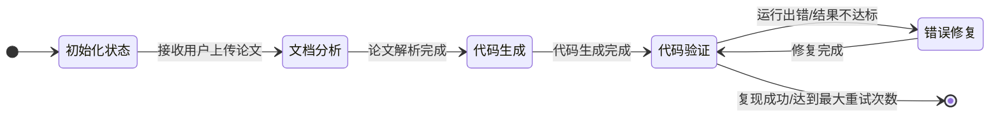

# MultiAgentPaperCoder 设计文档

## 概述

MultiAgentPaperCoder 是一个基于多智能体系统的自动化论文代码复现工具。该系统能够读取算法论文，理解算法实现，规划复现方案，生成可运行代码，并验证代码的正确性。系统采用 LangGraph 框架进行工作流编排，支持迭代优化，能够自动修复代码错误。

## 核心目标

1. 自动化论文算法代码复现流程
2. 降低论文复现的门槛
3. 提供代码生成的可追溯性和可解释性

## 技术栈

| 组件 | 技术选择 | 版本要求 |
|------|----------|----------|
| 开发语言 | Python 3.12+ | conda环境: py12pt |
| 大语言模型 | 智谱AI GLM-4.7 | 最新版本 |
| 智能体编排 | LangGraph | >=0.2.0 |
| LangChain | LangChain | >=0.2.0 |
| PDF解析 | PyPDF2 + pdfplumber | 最新版本 |
| 代码执行 | subprocess + conda | |

**技术决策说明**：选择 LangGraph 而非其他框架，因为 LangGraph 生态更成熟、文档更完善、社区支持更好，特别适合构建需要循环迭代的智能体应用。

## 系统架构

### 分层架构

系统采用超级智能体加子智能体的分层架构设计，将整个系统的实现能力明确划分为 Agent 层和 Tool 层两个层面。

- **Agent 层**：负责高层次的决策、规划和协调
- **Tool 层**：提供具体的基础能力支持（PDF解析、代码执行等）

这种分层设计使得系统的职责划分更加清晰，Agent 层专注于智能决策，Tool 层专注于基础能力的提供，两者协作完成复杂的复现任务。

### 架构图

```
┌─────────────────────────────────────────────────────────┐
│                     第一层：用户界面层                     │
│  ┌───────────────────────────────────────────────────┐  │
│  │                  用户交互界面                      │  │
│  └───────────────────────────────────────────────────┘  │
└─────────────────────────────────────────────────────────┘
                              │
                              ▼
┌─────────────────────────────────────────────────────────┐
│                     第二层：调度层                       │
│  ┌───────────────────────────────────────────────────┐  │
│  │     超级智能体（全局调度、任务分配、异常处理）       │  │
│  └───────────────────────────────────────────────────┘  │
└─────────────────────────────────────────────────────────┘
                              │
                              ▼
┌─────────────────────────────────────────────────────────┐
│                     第三层：Agent 层                    │
│  ┌──────────────────┐  ┌──────────────────┐        │
│  │  文档分析智能体   │  │  代码生成智能体   │        │
│  └──────────────────┘  └──────────────────┘        │
│  ┌──────────────────┐  ┌──────────────────┐        │
│  │  代码验证智能体   │  │  错误修复智能体   │        │
│  └──────────────────┘  └──────────────────┘        │
└─────────────────────────────────────────────────────────┘
                              │
                              ▼
┌─────────────────────────────────────────────────────────┐
│                     第四层：Tool 层                     │
│  ┌──────────────────┐  ┌──────────────────┐        │
│  │  PDF 解析工具     │  │  代码执行工具     │        │
│  └──────────────────┘  └──────────────────┘        │
│  ┌──────────────────┐  ┌──────────────────┐        │
│  │  大语言模型接口   │  │  领域知识库      │        │
│  └──────────────────┘  └──────────────────┘        │
└─────────────────────────────────────────────────────────┘
```

## Agent 设计

### 1. 超级智能体（SuperAgent）

**角色**：orchestrator / coordinator

**职责**：
- 协调各子 Agent 的执行顺序
- 维护全局状态（论文处理上下文）
- 处理 Agent 间的消息传递
- 错误恢复和重试逻辑
- 汇总最终结果

**能力（工具）**：
- State Manager: 管理论文处理状态
- Router: 决定下一个执行的 Agent
- Error Handler: 处理失败和重试

**输入**：PDF 文件路径
**输出**：完整复现报告

**实现文件**：`src/graph/workflow.py` (PaperCoderWorkflow 类)

### 2. 文档分析智能体（DocumentAnalysisAgent）

**角色**：document reader & algorithm extractor

**职责**：
- 调用 PDF 解析工具解析 PDF 论文
- 深入理解论文内容，识别算法核心逻辑
- 提取算法的关键步骤和实现细节
- 识别数据流和依赖关系
- 提取超参数、数据集要求等配置信息

**能力（工具）**：
- PDF Parser: pdfplumber/PyPDF2
- LLM Inference: 智谱 AI GLM-4.7
- Algorithm Detector: 算法名称识别
- Dependency Analyzer: 依赖关系提取
- Parameter Extractor: 超参数提取

**输入**：PDF 论文文件
**输出**：
```python
{
    "paper_content": {
        "title": str,
        "abstract": str,
        "sections": List[Dict],
        "formulas": List[str],
        "figures": List[str]
    },
    "algorithm_analysis": {
        "algorithm_name": str,
        "algorithm_type": str,
        "core_logic": str,
        "hyperparameters": Dict,
        "requirements": {
            "dataset": str,
            "frameworks": List[str],
            "compute": str
        },
        "data_flow": str
    }
}
```

**实现文件**：`src/agents/document_analysis_agent.py`

### 3. 代码生成智能体（CodeGenerationAgent）

**角色**：code architect & code writer

**职责**：
- 根据算法分析结果设计代码结构
- 规划文件组织方案
- 生成完整的 Python 代码文件
- 实现数据加载、模型定义、训练、评估模块
- 分析代码依赖，生成 requirements.txt
- 生成环境配置文件和文档

**能力（工具）**：
- LLM Inference: 智谱 AI GLM-4.7
- Code Templater: 代码模板引擎
- File Writer: 文件写入操作
- Dependency Resolver: 依赖解析

**输入**：算法分析报告
**输出**：
```python
{
    "code_plan": {
        "project_structure": List[Dict],
        "implementation_steps": List[str],
        "dependencies": {
            "python_packages": List[str],
            "system_packages": List[str]
        },
        "entry_points": List[str]
    },
    "generated_code": {
        "generated_files": List[Dict],
        "file_paths": List[str],
        "code_stats": Dict,
        "requirements_txt": str,
        "summary": str
    }
}
```

**实现文件**：`src/agents/code_generation_agent.py`

### 4. 代码验证智能体（CodeVerificationAgent）

**角色**：code tester & result evaluator

**职责**：
- 在本地环境中运行生成的代码
- 监控代码执行状态
- 记录完整的运行日志
- 收集代码运行的输出结果
- 对比运行结果与论文报告结果
- 评估复现质量，计算指标差异
- 识别运行过程中的错误和异常
- 生成验证报告和优化建议

**能力（工具）**：
- Conda Manager: conda 环境管理
- subprocess Executor: 代码执行
- Log Analyzer: 日志分析
- Result Evaluator: 结果评估

**输入**：生成的代码和配置文件
**输出**：
```python
{
    "verification_result": {
        "status": str,  # success/failed/partial
        "execution_time": float,
        "error_log": str,
        "fix_suggestions": List[str],
        "validation_report": str
    },
    "quality_score": float,  # 复现质量评分
    "needs_repair": bool,  # 是否需要修复
    "suggestions": List[str]  # 优化建议
}
```

**实现文件**：`src/agents/code_verification_agent.py`

### 5. 错误修复智能体（ErrorRepairAgent）

**角色**：code debugger

**职责**：
- 分析验证报告中的错误信息和运行日志
- 定位错误原因，判断错误类型
- 根据错误类型制定修复方案
- 修改代码中的 bug
- 调整不合理的超参数或配置
- 验证修复效果
- 记录错误修复过程

**能力（工具）**：
- LLM Inference: 智谱 AI GLM-4.7
- Error Analyzer: 错误分析
- Code Fixer: 代码修复
- Dependency Updater: 依赖更新

**输入**：错误信息、运行日志、原始代码
**输出**：
```python
{
    "root_cause": str,  # 错误根本原因
    "files_fixed": List[str],  # 修复的文件列表
    "repair_description": str,  # 修复描述
    "verification_status": str  # 验证状态
}
```

**实现文件**：`src/agents/error_repair_agent.py`

## Tool 设计

### 1. PDF 解析工具（PDFParser）

**技术选型**：pdfplumber / PyPDF2

**功能**：
- 提取 PDF 文件中的文本内容和表格信息
- 保留文本布局结构
- 提取章节标题和层次结构
- （可选）提取公式和图表描述

**实现文件**：`src/tools/pdf_parser.py`

### 2. 大语言模型接口（LLMClient）

**技术选型**：LangChain + 智谱 AI GLM-4.7

**功能**：
- 封装智谱 AI API 调用
- 支持流式输出
- 支持结构化 JSON 输出
- 错误重试机制
- Token 使用统计

**实现文件**：`src/tools/llm_client.py`

### 3. 代码执行工具（CodeExecutor）

**技术选型**：subprocess + conda

**功能**：
- 在指定的 conda 环境中执行代码
- 捕获 stdout/stderr
- 记录执行时间
- 超时控制

**实现文件**：`src/tools/code_executor.py`

## 工作流设计

### 状态定义

```python
from typing import TypedDict, List, Dict, Optional

class PaperState(TypedDict, total=False):
    # 输入
    pdf_path: str

    # PDF 读取结果
    paper_content: Optional[Dict[str, Any]]

    # 算法分析结果
    algorithm_analysis: Optional[Dict[str, Any]]

    # 代码规划结果
    code_plan: Optional[Dict[str, Any]]

    # 代码生成结果
    generated_code: Optional[Dict[str, Any]]

    # 验证结果
    verification_result: Optional[Dict[str, Any]]

    # 错误修复历史
    repair_history: List[Dict[str, Any]]

    # 控制信息
    current_step: str
    errors: List[str]
    retry_count: int
    max_retries: int
    iteration_count: int
    max_iterations: int
```

### 工作流图



### 决策逻辑

1. **顺序执行**：各 Agent 按顺序执行，前一个成功后执行下一个
2. **错误处理**：遇到错误时，根据错误类型决定重试或退出
3. **迭代优化**：当代码运行出错或结果不符合要求时，自动返回前面的环节进行优化
4. **最大迭代次数**：设置为 5 次，避免无限循环

## 配置管理

### 环境变量配置（.env）

```bash
# LLM 配置
LLM_PROVIDER=zhipu
ZHIPU_API_KEY=your_api_key_here
ZHIPU_MODEL=glm-4.7
ZHIPU_BASE_URL=https://open.bigmodel.cn/api/paas/v4

# 通用 LLM 配置
LLM_MAX_TOKENS=128000
LLM_TEMPERATURE=0.7

# 执行配置
CONDA_ENV_NAME=py12pt
OUTPUT_DIR=./output/generated_code
MAX_RETRIES=3
TIMEOUT_SECONDS=300

# 日志配置
LOG_LEVEL=INFO
LOG_FILE=./output/logs/multi_agent.log

# PDF 解析配置
PDF_PARSER_ENGINE=pdfplumber
EXTRACT_FORMULAS=true
EXTRACT_FIGURES=true
```

## 提示词管理

### 提示词格式

系统支持两种提示词格式：

1. **YAML 格式（推荐）**：位于 `src/prompts/*.yaml`，包含元数据
2. **TXT 格式（遗留）**：位于 `prompts/*.txt`，向后兼容

### YAML 格式示例

```yaml
name: code_generator
input_variables:
  - algorithm_info
  - code_plan
output_format:
  files:
    - path: string
    - content: string
  requirements_txt: string
  summary: string
template: |
    你是资深Python开发工程师和机器学习专家，需要根据论文描述生成可运行的代码实现。
    请严格遵循论文中的算法描述，生成完整的Python项目，要求：
    1. 代码结构清晰，模块化设计，符合PEP8规范
    2. 添加详细的中文注释，解释关键实现步骤
    3. 包含数据处理、模型实现、训练、评估完整流程
    4. 关键超参数可配置，提供命令行参数接口
    5. 输出结果与论文评价指标格式对齐

    算法信息：
    {algorithm_info}

    代码规划：
    {code_plan}
```

## 依赖管理

### Python 依赖

```txt
langgraph>=0.2.0
langchain>=0.2.0
langchain-anthropic>=0.2.0
anthropic>=0.25.0
PyPDF2>=3.0.0
pdfplumber>=0.10.0
pydantic>=2.0.0
python-dotenv>=1.0.0
tqdm>=4.66.0
rich>=13.0.0
```

### 系统依赖

- conda/miniconda
- Python 3.12+
- CUDA（如果涉及 GPU 训练）

## 测试环境

### 硬件配置

- CPU: Intel i7-13650HX
- 内存: 24GB
- GPU: RTX 4060
- 存储: SSD

### 软件环境

- 操作系统: Ubuntu 22.04 LTS
- Python: 3.12
- conda 环境: py12pt
- LLM: 智谱 AI GLM-4.7

## 可扩展性

1. **自定义 Prompt**：支持用户自定义提示词模板
2. **多 LLM 支持**：支持切换不同的 LLM 后端

## 文档说明

本文档将随着项目开发进展持续更新，保持与实际代码实现的一致性。
